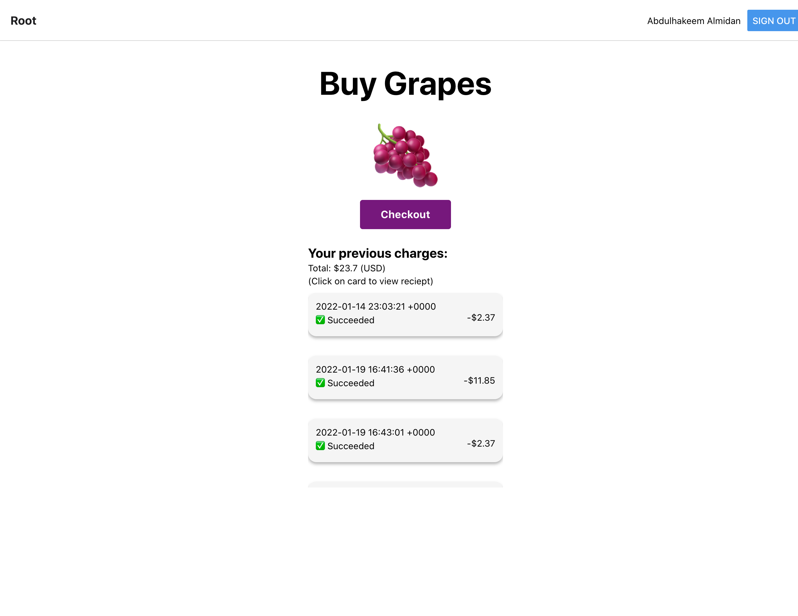

# Buy Grapes
A simple web/iOS/Android app that lets users signup, buy grapes, and view their pevious transactions.

## Tools used (and the use behind each):
- Expo
  - For making a web/iOS/Android compatable app using React Native.
- Firebase
  - For OAuth, and for storing transactions per user (stored in Firestore).
- Zapier
  - For a webhook that listens for Stripe charges and creates a transaction Firestore document for the associated user if there's any (mapped using email).
- Stripe
  - For payment processing.
  - A [Stripe Payments page](https://stripe.com/docs/connect/creating-a-payments-page) was used to not deal with creating a server, or with creating Firebase cloud functions (which require an account upgrade).

## Screenshot

